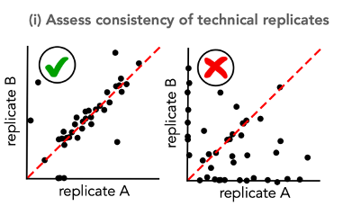

<br/>

##### Here, we show CellDestiny functionalities using lentiviral barcoding data studied in \href{https://github.com/TeamPerie/HadjAbed-et-al._2022}{HadjAbed et al. 2022}.

<br/>

<br/>

##### Go on the web app : \url{https://perie-team.shinyapps.io/CellDestiny/}.

```{r setup, include=FALSE, warning=FALSE, message=FALSE}
library(ggplot2)
library(devtools)
#load packages
devtools::install_github("TeamPerie/CellDestiny", quiet = TRUE)
library(CellDestiny)
```

## QC

### Load data and select dupliacte variable name 

##### The first step of the QC part of the app is to load count and metadata matrcies and select the variable describing your ***duplicates***. It corresponds to one of your metadata column name. 

```{r, echo=FALSE, warning=FALSE, message=FALSE}
# set working directory
setwd(getwd())
# import files
count_matrix <- read.csv("../../testData/LentiviralBarcodingData/QC_data/QC_duplicate_matrix_Mouse_Lung_cDCs.csv.gz")
metadata <- read.csv("../../testData/LentiviralBarcodingData/QC_data/QC_duplicate_matrix_Mouse_Lung_cDCs_metadata.csv.gz")

metadata
```

##### Here, it is "duplicates".

```{r, echo=FALSE, warning=FALSE, message=FALSE}
# Common parameters
dup_var="duplicates"
dup_val=metadata$duplicates

qc_mat<-ReformatQCmatrix(count_matrix, metadata, dup_var, dup_val, sampleNameFieldsep = "_", transformation = "arcsin")

# Here, sampleNameFieldsep and transformation parameters are set to default ones. 
# The transformation is applied to duplicat columns and saved in trans_dup1 and trans_dup2 column names as follow. 
```

### Duplicates checking 

##### Here we look at the consistency of technical replicates.




```{r, echo=FALSE, warning=FALSE, message=FALSE}
# parameter describing our cell types 
list_var = c("type")
list_val = metadata$type

dup_mat<-MakeDuplicatesMatrix(matrix = qc_mat, listVar = list_var, listVal = list_val, metadata = metadata)
PlotDuplicates(dup_mat, dup_val, transformation = "arcsin")
```

### Repeat Use checking 

##### Here we assess the frequency of repeat use barcodes in the data. Repeat used barcodes are compared between individuals.


```{r, echo=FALSE, warning=FALSE, message=FALSE}
# parameter describing our cell types 
list_var = c("type")
list_val = metadata$type
#parameters
indiv_var="mouse"
indiv_val=metadata$mouse

ru_mat<-MakeRepeatUseMatrix(qc_mat, indiv_var, indiv_val)
PlotRepeatUse(ru_mat, indiv_var,textSize = 12)
```


##### Both duplicates and repeat use checking are ok. We can now go further in the biological analysis and use the analysis part once duplicated samples are merged. 

## Analsyis part 

### Load data and select individuals variable name 

##### The first step of the analysis part of the app is to load count and metadata matrcies and select the variable describing your ***individuals***. It corresponds to one of your metadata column name. 

```{r, echo=FALSE, warning=FALSE, message=FALSE}
# set working directory
setwd(getwd())
# import files
count_matrix <- read.csv("../../testData/LentiviralBarcodingData/Analysis_data/Analysis_matrix_Mouse_Lung_cDCs.csv.gz")
metadata <- read.csv("../../testData/LentiviralBarcodingData/Analysis_data/Analysis_matrix_Mouse_Lung_cDCs_metadata.csv.gz")
metadata

# Common parameters
indiv_var="mouse"
indiv_val=c("2", "4", "5") # you can change it according if you  want to plot all individuals or not
```


### Sample similarities

Similarities between samples can be visualized using a heatmap together with hierarchical clustering and using a correlogram. 

#### Heatmap 

```{r, echo=FALSE, warning=FALSE, message=FALSE}
## heatmap functions parameters 
list_var = c("type")
list_val = metadata$type
distance<-"euclidean"
clusteringMeth<-"complete"
dendro<-"yes"
barcodes<-"no"
nclust<-3
pool=FALSE # do you want to pool individuals ?

heat_mat<-MakeHeatmapMatrix(matrix = count_matrix, metadata = metadata, indivVar = indiv_var, indivVal = indiv_val, listVar = list_var,  listVal = list_val, poolIndiv = pool)
p<-PlotHeatmap(heat_mat, distance = distance, clustering = clusteringMeth, showDendro = dendro, showBarcodes = barcodes, nClusters = nclust, columnTextSize = 1.5)
```

#### Correlogram 

Spearman correleations are outputed.

```{r, echo=FALSE, warning=FALSE, message=FALSE}
p<-PlotCorrelogram(heat_mat) 
```


### Clone sizes

CellDestiny offers two types of clone size visualizations. The first one is a cumulative diagram. If the cumulative graph has a concave shape, it means that a cell population is dominated by a small number of large clones. On the contrary, if the shape is linear, the sample is composed of a number of clones which contribute equally to the cellularity of the population. The second type of graph is a frequency distribution plot where the user can choose between histogram or density curve-based representations of the data. 

##### Get clone size distributions using an histogram

```{r, echo=FALSE, warning=FALSE, message=FALSE}
# fill wanted parameters
list_var = c("type")
list_val = metadata$type
indiv_val=c("2", "4", "5")
colorFreq="type"

freq_mat<-MakeBarcodeFrequenciesMatrix(count_matrix, metadata, indiv_var, indiv_val, list_var, list_val)
PlotBarcodeFrequencies(freq_mat, colorFreq, y = "histogram", nbins = 10)
```

```{r, echo=FALSE, warning=FALSE, message=FALSE}
PlotBarcodeFrequencies(freq_mat, colorFreq, y="density", nbins = 10)
```

##### Plot clone-size distributions using a cumulative frequency diagram.

```{r, echo=FALSE, warning=FALSE, message=FALSE}
list_var = c("type")
list_val = metadata$type
colorCum="type"

cum_mat_notxProp<-MakeCumulativeDiagramMatrix(count_matrix, metadata, indiv_var, indiv_val, list_var, list_val, colorCum)
PlotCumulativeDiagram(cum_mat_notxProp,indiv_var, colorCum)

# add xProp = "yes"
cum_mat_xProp<-MakeCumulativeDiagramMatrix(count_matrix, metadata, indiv_var, indiv_val, list_var, list_val, colorCum, xProp = "yes")
PlotCumulativeDiagram(cum_mat_xProp,indiv_var, colorCum, xProp = "yes")
```

### Diversity 

Comparing sample diversities is a common step in lineage tracing analysis. Diversity is computed using the vegan R package. 

##### Quantify clonal diversity between cDC1 and cDC2 using the Shannon Index.

```{r, echo=FALSE, warning=FALSE, message=FALSE}
boxplotColor_var=""
diversityVar<-"Shannon index"

div_mat<-CalculDiversity(count_matrix, metadata, indiv_var, indiv_val, list_var, list_val ,colorVar=boxplotColor_var, diversity=diversityVar)
PlotDiversity(div_mat,diversityVar, list_var, indiv_var, colorVar=boxplotColor_var, dots = "yes")
```

##### Now lets see if barcode abundances are similar between our cDC1 and cDC2 samples using scatter plot and pie chart visualisations.

```{r, echo=FALSE, warning=FALSE, message=FALSE}
## parameters for both dotplot and correlogram are similar
x_var<-c("type")
x_val<-c("cDC1")
y_var<-c("type")
y_val<-c("cDC2")
color="" # we dont want color

dot_mat<-MakeDotPlotMatrix(count_matrix, metadata, indiv_var, indiv_val,x_var, x_val,y_var, y_val, color)
PlotDotplot(dot_mat, indiv_var, color, textSize = 15) 
```


```{r, echo=FALSE, warning=FALSE, message=FALSE}
pie_mat<-MakePieChartMatrix(dot_mat, indiv_var, color)
PlotPieChart(pie_mat, textSize = 5) 
```


### Categorisation

To classify barcodes by their lineage bias, CellDestiny uses a threshold based classifier lineage described (Naik et al. 2013b). In summary, an additional normalization step per barcode is applied in each individual, thereby enabling categorization of each barcode into classes of biased output towards the analyzed cell types. Barcodes are assigned a bias based on whether the % read abundance exceeds a threshold value. If one barcode contributes to a given lineage above the designated threshold then this barcode is assigned to be biased towards that lineage. Barcodes for which the % read abundance exceeds a threshold value across multiple lineages are classified as multi-outcome. In the CellDestiny app, the threshold used for categorization can be tuned manually. 

##### 10% bias  

```{r, echo=FALSE, warning=FALSE, message=FALSE}
# Get category variable and values
catVar<-"type"
catVal<-metadata$type

slider<-10 # change the bias threshold thanks to this parameter

## the first matrix of the list outputed by MakeCategoryMatrices() is needed for PlotCategories() input matrix
count_per_type<-MakeCategoryMatrices(count_matrix, metadata, indiv_var, indiv_val, catVar, catVal, slider)[[1]]
PlotCategories(count_per_type, slider) 

## the second matrix of the list outputed by MakeCategoryMatrices() is needed for PlotCategoryCounts() input matrix
count_per_cat<-MakeCategoryMatrices(count_matrix, metadata, indiv_var, indiv_val, catVar, catVal, slider)[[2]]
PlotCategoryCounts(count_per_cat, slider)
```


