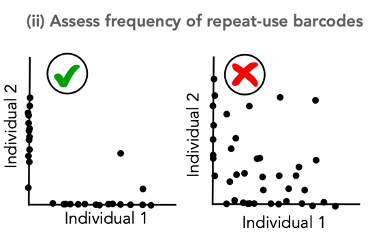

<br/>

##### Overview

In this vignette, we provide a walkthrough analysis of a lentiviral barcoding study of dendritic cells as described in: \href{https://github.com/TeamPerie/HadjAbed-et-al._2022}{HadjAbed et al. 2022}. Specifically, we wish to assess if a single MPP4 can produce both the cDC1 and the cDC2 subsets in the lung or whether a single MPP4 is fate-restricted to only produce cDC1 or cDCs. 

To address this research question, we used a lentiviral barcoding approach focusing on the differentiation of (Lin-, Sca-1+, cKit+, Flt3+) MPP4s towards lung-resident cDCs. Murine MPP4s were purified from the bone marrow of donor mice by fluorescence activated cell sorting and infected with the LG2.2 lentiviral barcoding library. Labelled cells where then injected I.V into 3 irradiated recipient mice. 14 days later, lungs were isolated from the mice, and barcoded cDC1s, and cDC2s were purified by FACS. Samples were then processed for barcode detection in genomic DNA by deep sequencing.


<br/>


## Step 1: Open CellDestiny

<br/>


Open the CellDestiny app using the following link : \url{https://perie-team.shinyapps.io/CellDestiny/}.

Once opened, you see on the left a menu with the QC and Analysis modules. Both have their respective "Load data" prompts which can be used to load countmatrix and metadata input files. Select the QC tab, and click the 'load test data' option.


The first step of the QC part of the app is to load count and metadata matrcies and select the variable describing your ***technical replicates***. It corresponds to one of your metadata column names. In this analysis our technical replicates are listed as "duplicates".


```{r setup, include=FALSE, warning=FALSE, message=FALSE}
library(ggplot2)
library(devtools)
#load packages
#devtools::install_github("TeamPerie/CellDestiny", quiet = TRUE)
library(CellDestiny)
```

<br/>


## Step 2: Using the Data QC Visualisation Module

<br/>


```{r, echo=FALSE, warning=FALSE, message=FALSE}
# set working directory
setwd(getwd())
# import files
count_matrix <- read.csv("../../testData/LentiviralBarcodingData/QC_data/QC_duplicate_matrix_Mouse_Lung_cDCs.csv.gz")
metadata <- read.csv("../../testData/LentiviralBarcodingData/QC_data/QC_duplicate_matrix_Mouse_Lung_cDCs_metadata.csv.gz")
```


```{r, echo=FALSE, warning=FALSE, message=FALSE}
# Common parameters
dup_var="duplicates"
dup_val=metadata$duplicates

metadata

qc_mat<-ReformatQCmatrix(count_matrix, metadata, dup_var, dup_val, sampleNameFieldsep = "_", transformation = "arcsin")

# Here, sampleNameFieldsep and transformation parameters are set to default ones. 
# The transformation is applied to duplicat columns and saved in trans_dup1 and trans_dup2 column names as follow. 
```

<br/>


##### Assessing the consistency of technical replicates

<br/>


PCR technical replicates allow to measure the degree of confidence in barcode detection to establish lineage relationship between cell types. If the replicates do not show high correlation, there may an issue with barcode contamination or it may suggest poor recovery of daughter cells or poor expansion of progenitors. In CellDestiny, technical replicates can be uploaded and visualized for each sample. 

<br/>


<br/>


```{r, echo=FALSE, warning=FALSE, message=FALSE, fig.cap = "\\label{fig:figs}Checking the consistency of technical replicates"}
# parameter describing our cell types 
list_var = c("type")
list_val = metadata$type

dup_mat<-MakeDuplicatesMatrix(matrix = qc_mat, listVar = list_var, listVal = list_val, metadata = metadata)
PlotDuplicates(dup_mat, dup_val, transformation = "arcsin")
```
<br/>

\newpage

#### Assess the frequency of repeat-use barcodes

<br/>


The integration of the same barcode into multiple cells, called repeat usage, is also an important QC metric that should be considered in a lineage tracing analysis pipeline, as a high incidence of repeat usage may lead to false lineage relationship assignments. The transfer of progenitors from the same transduction batch into at least two separate mice, followed by subsequent comparison of the barcodes recovered from those mice, can be used to estimate the frequency of repeat barcode use within one mouse. 



<br/>


```{r, echo=FALSE, warning=FALSE, message=FALSE,fig.cap = "\\label{fig:figs}assessing the frequency of repreat-use barcodes" }
# parameter describing our cell types 
list_var = c("type")
list_val = metadata$type
#parameters
indiv_var="mouse"
indiv_val=metadata$mouse

ru_mat<-MakeRepeatUseMatrix(qc_mat, indiv_var, indiv_val)
PlotRepeatUse(ru_mat, indiv_var,textSize = 12)
```


Both duplicates and repeat use checking are ok. We can now go further in the biological analysis and use the analysis part once duplicated samples are merged. 

<br/>


\newpage


## Step 3: Using the Data Analysis Module

First we need to load the metadata and count matrices into the analysis module.We then select the variable describing your ***individuals***. It corresponds to one of your metadata column name. For the test dataset, it is "mouse".

<br/>


```{r, echo=FALSE, warning=FALSE, message=FALSE }
# set working directory
setwd(getwd())
# import files
count_matrix <- read.csv("../../testData/LentiviralBarcodingData/Analysis_data/Analysis_matrix_Mouse_Lung_cDCs.csv.gz")
metadata <- read.csv("../../testData/LentiviralBarcodingData/Analysis_data/Analysis_matrix_Mouse_Lung_cDCs_metadata.csv.gz")
metadata

# Common parameters
indiv_var="mouse"
indiv_val=c("2", "4", "5") # you can change it according if you  want to plot all individuals or not
```

<br/>


#### Sample similarities

Similarities between samples can be visualized using a heatmap together with hierarchical clustering and using a correlogram. 


<br/>


```{r, echo=FALSE, warning=FALSE, message=FALSE, fig.cap = "\\label{fig:figs2}assessing sample similarity using a heatmap and correlogram visualisations" }
## heatmap functions parameters 
list_var = c("type")
list_val = metadata$type
distance<-"euclidean"
clusteringMeth<-"complete"
dendro<-"yes"
barcodes<-"no"
nclust<-3
pool=FALSE # do you want to pool individuals ?

heat_mat<-MakeHeatmapMatrix(matrix = count_matrix, metadata = metadata, indivVar = indiv_var, indivVal = indiv_val, listVar = list_var,  listVal = list_val, poolIndiv = pool)
p<-PlotHeatmap(heat_mat, distance = distance, clustering = clusteringMeth, showDendro = dendro, showBarcodes = barcodes, nClusters = nclust, columnTextSize = 1.5)
```


<br/>


```{r, echo=FALSE, warning=FALSE, message=FALSE, fig.cap = "\\label{fig:figs}Spearamans correlations between technical replicates" }
p<-PlotCorrelogram(heat_mat) 
```


<br/>

\newpage


### Clone sizes

CellDestiny offers two types of clone size visualizations. The first one is a cumulative diagram. If the cumulative graph has a concave shape, it means that a cell population is dominated by a small number of large clones. On the contrary, if the shape is linear, the sample is composed of a number of clones which contribute equally to the cellularity of the population. The second type of graph is a frequency distribution plot where the user can choose between histogram or density curve-based representations of the data. 


<br/>


```{r, echo=FALSE, warning=FALSE, message=FALSE ,fig.cap = "\\label{fig:figs}assessing clone size distributions" }
# fill wanted parameters
list_var = c("type")
list_val = metadata$type
indiv_val=c("2", "4", "5")
colorFreq="type"

freq_mat<-MakeBarcodeFrequenciesMatrix(count_matrix, metadata, indiv_var, indiv_val, list_var, list_val)
PlotBarcodeFrequencies(freq_mat, colorFreq, y = "histogram", nbins = 10)
```

<br/>


```{r, echo=FALSE, warning=FALSE, message=FALSE, fig.cap = "\\label{fig:figs}assessing clone-size distributions" }
PlotBarcodeFrequencies(freq_mat, colorFreq, y="density", nbins = 10)
```

<br/>


Now lets plot the clone-size distributions using a cumulative frequency diagram.

<br/>


```{r, echo=FALSE, warning=FALSE, message=FALSE, fig.cap = "\\label{fig:figs}assessing the cumulative distribution of barcode abundances" }
list_var = c("type")
list_val = metadata$type
colorCum="type"


# add xProp = "yes"
cum_mat_xProp<-MakeCumulativeDiagramMatrix(count_matrix, metadata, indiv_var, indiv_val, list_var, list_val, colorCum, xProp = "yes")
PlotCumulativeDiagram(cum_mat_xProp,indiv_var, colorCum, xProp = "yes")
```

<br/>


```{r, echo=FALSE, warning=FALSE, message=FALSE, fig.cap = "\\label{fig:figs}assessing the cumulative distribution of barcode abundances" }
list_var = c("type")
list_val = metadata$type
colorCum="type"

# add xProp = "yes"
cum_mat_xProp<-MakeCumulativeDiagramMatrix(count_matrix, metadata, indiv_var, indiv_val, list_var, list_val, colorCum, xProp = "yes")
PlotCumulativeDiagram(cum_mat_xProp,indiv_var, colorCum, xProp = "yes")
```

<br/>

\newpage

### Diversity 


<br/>


Comparing sample diversities is a common step in lineage tracing analysis. Diversity is computed using the vegan R package. 

Quantify clonal diversity between cDC1 and cDC2 using the Shannon Index.

```{r, echo=FALSE, warning=FALSE, message=FALSE, fig.cap = "\\label{fig:figs}assessing barcode diversity" }
boxplotColor_var=""
diversityVar<-"Shannon index"

div_mat<-CalculDiversity(count_matrix, metadata, indiv_var, indiv_val, list_var, list_val ,colorVar=boxplotColor_var, diversity=diversityVar)
PlotDiversity(div_mat,diversityVar, list_var, indiv_var, colorVar=boxplotColor_var, dots = "yes")
```

<br/>

\newpage


### Barcode Sharing

<br/>


Now lets see if barcode abundances are similar between our cDC1 and cDC2 samples using scatter plot and pie chart visualisations.

<br/>


```{r, echo=FALSE, warning=FALSE, message=FALSE,fig.cap = "\\label{fig:figs}assessing barocde sharing" }
## parameters for both dotplot and correlogram are similar
x_var<-c("type")
x_val<-c("cDC1")
y_var<-c("type")
y_val<-c("cDC2")
color="" # we dont want color

dot_mat<-MakeDotPlotMatrix(count_matrix, metadata, indiv_var, indiv_val,x_var, x_val,y_var, y_val, color)
PlotDotplot(dot_mat, indiv_var, color, textSize = 15) 
```


```{r, echo=FALSE, warning=FALSE, message=FALSE,fig.cap = "\\label{fig:figs}assessing barcode sharing using a pie chart" }
pie_mat<-MakePieChartMatrix(dot_mat, indiv_var, color)
PlotPieChart(pie_mat, textSize = 5) 
```


<br/>


### Categorisation

<br/>


To classify barcodes by their lineage bias, CellDestiny uses a threshold based classifier lineage described (Naik et al. 2013b). In summary, an additional normalization step per barcode is applied in each individual, thereby enabling categorization of each barcode into classes of biased output towards the analyzed cell types. Barcodes are assigned a bias based on whether the % read abundance exceeds a threshold value. If one barcode contributes to a given lineage above the designated threshold then this barcode is assigned to be biased towards that lineage. Barcodes for which the % read abundance exceeds a threshold value across multiple lineages are classified as multi-outcome. In the CellDestiny app, the threshold used for categorization can be tuned manually. Here we use a fixed threshold value of 10%.

<br/>


```{r, echo=FALSE, warning=FALSE, message=FALSE,fig.cap = "\\label{fig:figs}lineage classification analysis 10% bias"}
# Get category variable and values
catVar<-"type"
catVal<-metadata$type

slider<-10 # change the bias threshold thanks to this parameter

## the first matrix of the list outputed by MakeCategoryMatrices() is needed for PlotCategories() input matrix
count_per_type<-MakeCategoryMatrices(count_matrix, metadata, indiv_var, indiv_val, catVar, catVal, slider)[[1]]
PlotCategories(count_per_type, slider) 

```

<br/>
\newpage

```{r, echo=FALSE, warning=FALSE, message=FALSE,fig.cap = "\\label{fig:figs}lineage classification analysis 10% bias"}
# Get category variable and values
catVar<-"type"
catVal<-metadata$type

slider<-10 # change the bias threshold thanks to this parameter


## the second matrix of the list outputed by MakeCategoryMatrices() is needed for PlotCategoryCounts() input matrix
count_per_cat<-MakeCategoryMatrices(count_matrix, metadata, indiv_var, indiv_val, catVar, catVal, slider)[[2]]
PlotCategoryCounts(count_per_cat, slider)
```


