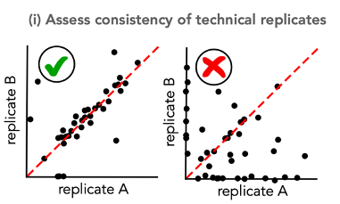
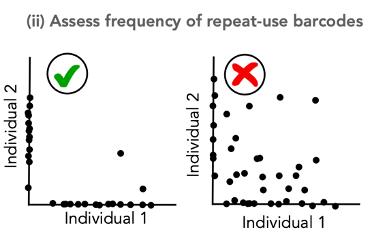

<br/>

##### Here, we show how to use CellDestiny as a package using lentiviral barcoding data studied in https://github.com/TeamPerie/HadjAbed-et-al._2022.

##### In this script we visualise key QC steps of the data before proceeding to make comparisons between cDC1 and cDC2 dendritic cells subtypes in three mice. 

<br/>
 
### Install the package and load libraries

```{r setup, include=TRUE, warning=FALSE, message=FALSE}
library(devtools)
devtools::install_github("TeamPerie/CellDestiny", quiet = TRUE)
library(CellDestiny)
library(ggplot2)
```

### Load data and give duplicat variable name 

##### Like for the application format, the first step of the QC part of the package format is to load count and metadata matrcies and give the name of the variable describing your ***duplicates***. It corresponds to one of your metadata column name. 

```{r, echo=TRUE, warning=FALSE, message=FALSE}
# set working directory
setwd(getwd())
# import files
count_matrix <- read.csv("../../testData/LentiviralBarcodingData/QC_data/QC_duplicate_matrix_Mouse_Lung_cDCs.csv.gz")
metadata <- read.csv("../../testData/LentiviralBarcodingData/QC_data/QC_duplicate_matrix_Mouse_Lung_cDCs_metadata.csv.gz")

metadata
```

##### Here, it is "duplicates".

```{r, echo=TRUE, warning=FALSE, message=FALSE}
# Common parameters
dup_var="duplicates"
dup_val=metadata$duplicates
```

### Reformat matrix for QC

#### The first function to call is ReformatQCmatrix() that calcul correlations and transforms your count matrix in a way that fits MakeDuplicatesMatrix() or MakeRepeatUseMatrix() input matrix format. 

```{r, echo=TRUE, warning=FALSE, message=FALSE}
qc_mat<-ReformatQCmatrix(count_matrix, metadata, dup_var, dup_val, sampleNameFieldsep = "_", transformation = "arcsin")

# Here, sampleNameFieldsep and transformation parameters are set to default ones. 
# The transformation is applied to duplicat columns and saved in trans_dup1 and trans_dup2 column names as follow. 

head(qc_mat)
```

### Duplicates checking 

##### Here we look at the consistency of technical replicates.




##### We want to plot duplciates of all samples, not specific ones. To do so, we select all values from a variable (here variable type and its values).

```{r, echo=TRUE, warning=FALSE, message=FALSE}
# parameter describing our cell types 
list_var = c("type")
list_val = metadata$type

dup_mat<-MakeDuplicatesMatrix(matrix = qc_mat, listVar = list_var, listVal = list_val, metadata = metadata)
PlotDuplicates(dup_mat, dup_val, transformation = "arcsin")
```

### Repeat Use checking 

##### Here we assess the frequency of repeat use barcodes in the data. Repeat used barcodes are compared between individuals. Hence, fill out the variable name describing your individuals and all its values.





```{r, echo=TRUE, warning=FALSE, message=FALSE}
# parameter describing our cell types 
list_var = c("type")
list_val = metadata$type
#parameters
indiv_var="mouse"
indiv_val=metadata$mouse

ru_mat<-MakeRepeatUseMatrix(qc_mat, indiv_var, indiv_val)
PlotRepeatUse(ru_mat, indiv_var,textSize = 12)
```


##### Both duplicates and repeat use checking are ok. We can now go further in the biological analysis. Open 2.User_manual_for_analysis.html file.
